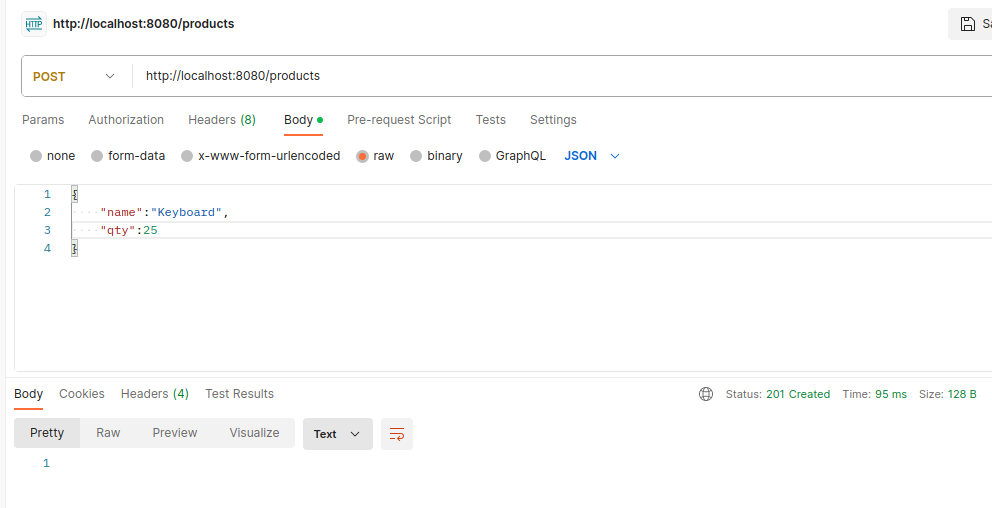
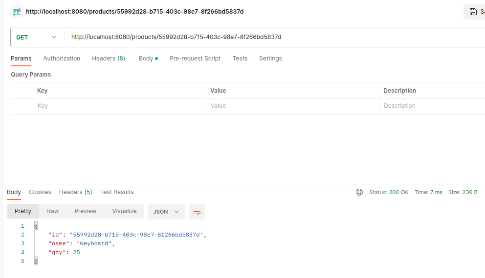
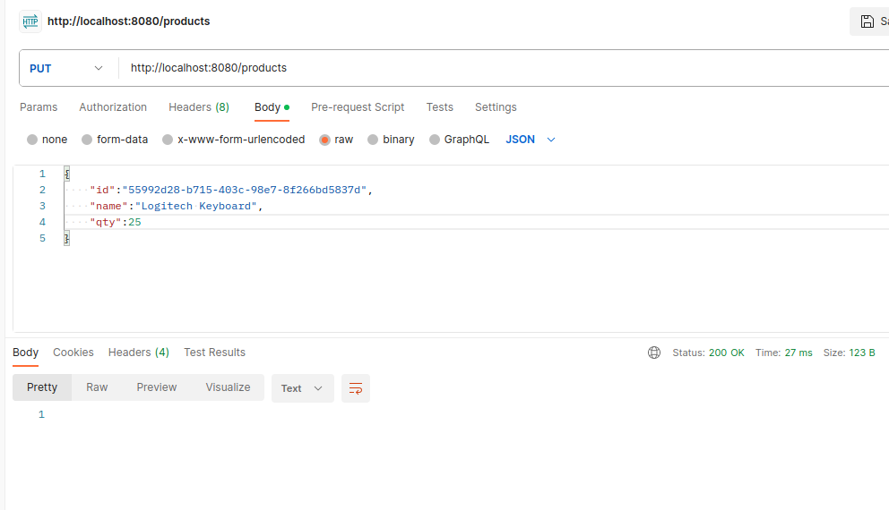
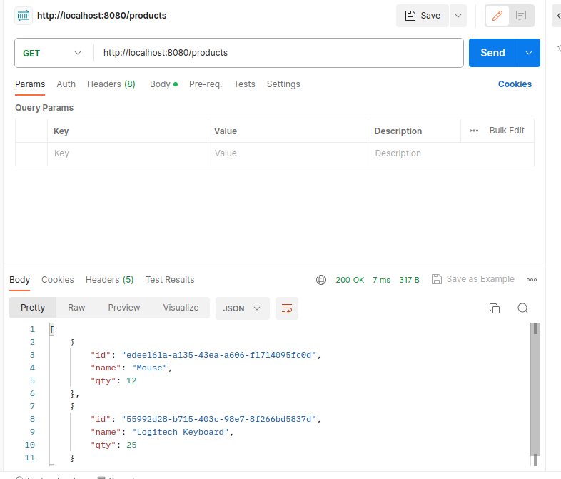
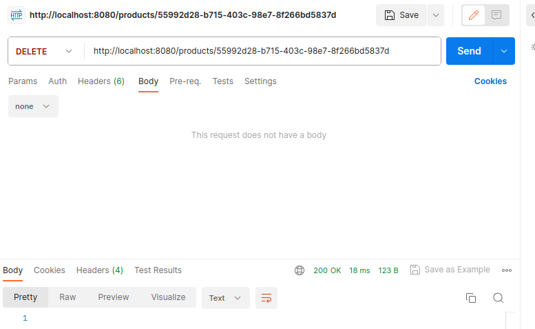

CRUD(Create, Read, Update, Delete) Spring boot with database postgres

### 1.  create database
docker run -d --name psql \
-e POSTGRES_USER=psql \
-e POSTGRES_PASSWORD=password \
-p 5432:5432 \
postgres:14

### 2. Run

#### add product

<code>curl --location 'http://localhost:8080/products' \
--header 'Content-Type: application/json' \
--data '{
"name":"Keyboard",
"qty":25
}'</code>

  

#### get product by id

<code>curl --location 'http://localhost:8080/products/55992d28-b715-403c-98e7-8f266bd5837d' </code>

  

#### update product

<code>curl --location --request PUT 'http://localhost:8080/products' \
--header 'Content-Type: application/json' \
--data '{
    "id":"55992d28-b715-403c-98e7-8f266bd5837d",
    "name":"Logitech Keyboard",
    "qty":25
}'</code>

  

#### get products

<code>curl --location 'http://localhost:8080/products' </code>

  

#### delete product

<code>curl --location --request DELETE 'http://localhost:8080/products/55992d28-b715-403c-98e7-8f266bd5837d' </code>

